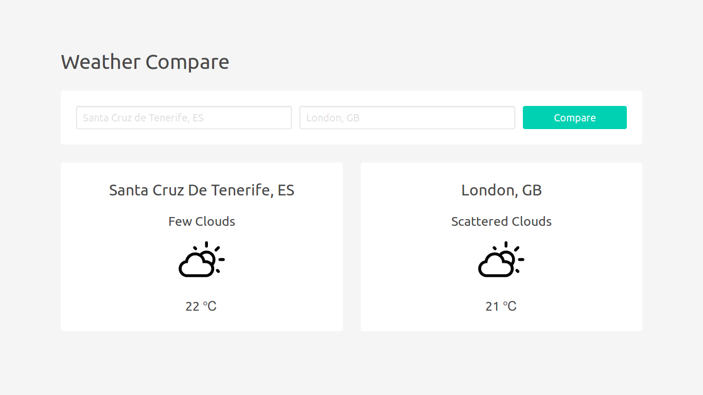

# JS Weather Compare

A simple ES6+ web app to compare the current weather of two cities.

## Demo

[lujanfernaud.com/js-weather-compare](http://lujanfernaud.com/js-weather-compare/)

## Built With

- ES6+
- [Weatherbit API](https://www.weatherbit.io/api)
- [Local Storage](https://developer.mozilla.org/en-US/docs/Web/API/Storage/LocalStorage)
- [Weather Icons](https://github.com/erikflowers/weather-icons)
- [Bulma](https://bulma.io/)

## Screenshot

<kbd>
  
</kbd>
